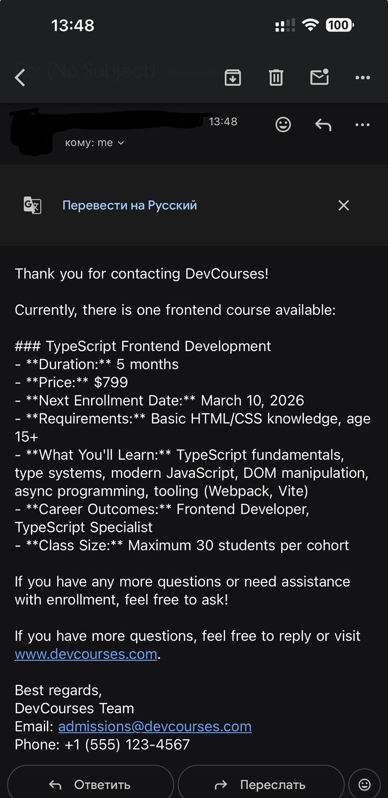

# DevCourses AI Email Agent

Intelligent email assistant powered by RAG (Retrieval Augmented Generation) for automatically answering course inquiries.

## 🎯 Features

- **RAG System**: Vector search through course knowledge base (FAISS + OpenAI embeddings)
- **Confidence Detection**: Automatically determines answer reliability (high/medium/low)
- **Admin Notifications**: Alerts admin when uncertain about answers
- **No Hallucinations**: Only answers based on knowledge base content
- **Easy Testing**: Simulation mode without email setup

## 📋 Requirements

- Python 3.11+
- OpenRouter API key (for AI model)
- Course knowledge base (included)

## 🚀 Quick Start

### 1. Install Dependencies

```bash
pip install -r requirements.txt
```

### 2. Configure Environment

Create/update `.env` file:

```env
OPENAI_API_KEY=your_openrouter_api_key_here
OPENROUTER_MODEL=openai/gpt-4o-mini
```

Get your OpenRouter API key at: https://openrouter.ai/

### 3. Run Agent

**Testing Mode** (no email setup needed):

```bash
# Simulation with example questions
python email_agent.py simulate

# Interactive mode
python email_agent.py
```

**Production Mode** (real email monitoring):

```bash
# Setup email credentials first (see below)
python email_monitor.py
```

## 📧 Email Setup (Production)

To monitor real emails, you need email credentials:

### Option 1: Gmail with App Password

1. Enable 2FA: https://myaccount.google.com/security
2. Create App Password: https://myaccount.google.com/apppasswords
3. Update `.env`:
```env
EMAIL_ADDRESS=your_email@gmail.com
EMAIL_APP_PASSWORD=xxxx xxxx xxxx xxxx
```

### Option 2: Other Email Service

Update `.env` with your IMAP/SMTP settings:
```env
EMAIL_ADDRESS=your_email@example.com
EMAIL_APP_PASSWORD=your_password
IMAP_SERVER=imap.example.com
SMTP_SERVER=smtp.example.com
SMTP_PORT=587
```

### Run Email Monitor

```bash
python email_monitor.py
```

The agent will:
- Check inbox every 30 seconds
- Process questions with RAG
- Send automatic replies
- Notify admin for uncertain questions

## 📁 Project Structure

```
.
├── email_agent.py           # Testing/simulation mode
├── email_monitor.py         # Production email monitoring
├── agent_system.py          # AI Agent with tools (recommended)
├── rag_system.py            # Direct RAG system (simpler)
├── courses_knowledge.txt    # Course information database
├── requirements.txt         # Python dependencies
├── .env                     # Configuration (API keys)
└── README.md               # This file
```

## 🏗️ Architecture

### Agent System (Recommended)
```
User Question → AI Agent → Decides to use search_courses tool → Vector Search → Agent formats response
```

Benefits:
- Agent can handle greetings without searching
- More flexible decision making
- Better conversation flow
- Tool-based architecture

### Direct RAG System (Simpler)
```
User Question → Vector Search → Format response
```

Benefits:
- Simpler code
- Faster responses
- Direct knowledge retrieval

## 🔧 How It Works

```
User Question
    ↓
RAG System (searches knowledge base with k=3)
    ↓
Confidence Analysis
    ├─ HIGH/MEDIUM → Send answer to user
    └─ LOW → Notify admin + Tell user admin will contact them
```

### Confidence Levels

| Level | Score | Action |
|-------|-------|--------|
| **High** | < 0.8 | Direct answer from knowledge base |
| **Medium** | 0.8 - 1.2 | Partial match, answer provided |
| **Low** | > 1.2 | No relevant info → Admin notified |

## 💡 Example Usage

### Email Response Example

The agent automatically responds to course inquiries:



**User Question:**
> "What courses do you offer in backend development?"

**Agent Response:**
> Thank you for contacting DevCourses!
> 
> We offer three backend development courses:
> 1. Python Backend Development ($899, 6 months) - Next enrollment: March 15, 2026
> 2. Java Backend Development ($999, 7 months) - Next enrollment: April 1, 2026
> 3. Node.js Backend Development ($849, 5 months) - Next enrollment: March 20, 2026
> 
> All courses include live online classes, hands-on projects, and career support.
> 
> If you have more questions, feel free to reply or visit www.devcourses.com.

### Simulation Mode

```bash
$ python email_agent.py simulate

🤖 DevCourses Email Agent - Simulation Mode
============================================================

📧 Processing question from: student1@example.com
Question: What courses do you offer in backend development?

🎯 Confidence: HIGH

📤 Response to user:
------------------------------------------------------------
Thank you for your question about DevCourses!

We offer three backend development courses:
1. Python Backend Development ($899, 6 months)
2. Java Backend Development ($999, 7 months)
3. Node.js Backend Development ($849, 5 months)
...
```

### Interactive Mode

```bash
$ python email_agent.py

🤖 DevCourses Email Agent - Interactive Mode
============================================================

User email: student@example.com
Question: How much is the Python course?

🎯 Confidence: HIGH

📤 Response to user:
The Python Backend Development course costs $899...
```

## 📚 Available Courses

### Backend Development
- **Python** - $899 (6 months) - Next: March 15, 2026
- **Java** - $999 (7 months) - Next: April 1, 2026
- **Node.js** - $849 (5 months) - Next: March 20, 2026

### Frontend Development
- **TypeScript** - $799 (5 months) - Next: March 10, 2026
- **React** - $899 (6 months) - Next: April 5, 2026
- **Next.js** - $1,099 (7 months) - Next: March 25, 2026

### Mobile Development
- **Kotlin (Android)** - $949 (6 months) - Next: April 10, 2026
- **Swift (iOS)** - $949 (6 months) - Next: April 15, 2026

### Game Development
- **C++ (Unreal)** - $1,199 (8 months) - Next: March 30, 2026
- **C# (Unity)** - $1,099 (7 months) - Next: April 20, 2026

## 🔌 Production Deployment

For production use:

1. **Use a dedicated email account** for the agent
2. **Set up email forwarding** from your main support email
3. **Monitor logs** for errors and performance
4. **Adjust check interval** based on email volume
5. **Set up alerts** for admin notifications

### Recommended Setup

```
support@devcourses.com (main)
    ↓ (forward)
agent@devcourses.com (monitored by AI)
    ↓ (auto-reply)
User receives response
```

## 🛠️ Customization

### Update Knowledge Base

Edit `courses_knowledge.txt` to add/modify course information, then restart the agent.

### Change Admin Email

In `email_agent.py`, update:
```python
self.admin_email = "your_admin@email.com"
```

### Adjust Confidence Thresholds

In `rag_system.py`, modify:
```python
if best_score < 0.8:      # High confidence
    confidence = "high"
elif best_score < 1.2:    # Medium confidence
    confidence = "medium"
else:                      # Low confidence
    confidence = "low"
```

## 📊 Admin Notifications

When confidence is LOW, admin receives notification:

```
============================================================
ADMIN NOTIFICATION
============================================================
Time: 2026-03-09 14:30:00
From: student@example.com
Reason: Low confidence in answer

Question:
Do you teach quantum physics?

Action Required: Manual review and response needed
============================================================
```

Admin email: **softwaremaestro16@gmail.com**

## 🐛 Troubleshooting

**Issue**: `ModuleNotFoundError`
```bash
pip install -r requirements.txt
```

**Issue**: `OPENAI_API_KEY not found`
- Check `.env` file exists
- Verify API key is correct
- Restart terminal/IDE

**Issue**: Low confidence on valid questions
- Update `courses_knowledge.txt` with more details
- Adjust confidence thresholds in `rag_system.py`

## 📝 License

MIT License - Feel free to use for your projects

## 🤝 Contributing

1. Fork the repository
2. Create feature branch
3. Commit changes
4. Push to branch
5. Open pull request

## 📧 Contact

For questions about DevCourses:
- Email: admissions@devcourses.com
- Phone: +1 (555) 123-4567
- Website: www.devcourses.com
